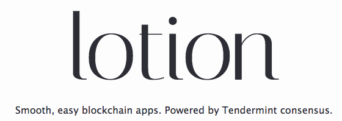

# Cosmic Bridge

Server node for the Cosmic Bridge application. Manages tracking payments/balance on the Cosmos chain and bundled scheduled payouts on the Bitcoin mainnet.

For architectural overview, see here: https://docs.google.com/presentation/d/1-8MP2yRhTy7D1YDUiauJoJ1g_ppXQbRpk0YTQ0ZFEzw/edit#slide=id.g3772f84a12_0_18

### Concept

The Cosmic Bridge server node both serves as a validator/facilitator of transactions and a repository of funds.

In order to participate in the Cosmic Bridge network, a user should send bitcoin to a particular payment zone address - a specific wallet on the Bitcoin blockchain. Once bitcoin has been received, users can batch bitcoin transactions off-chain using Lotion.js which is paid out while optimizing the number of required transactions.

* The server node will accumulate transactions of its participants.
* These transactions will be posted/validated by the cosmos distributed network, bundled, and can be paid out on demand.
* Users save transaction fees by bundling up transactions on the bitcoin network.

### Potential Uses

Cosmic Bridge can be used for any application that requires cheap, fast and auditable settlement of Bitcoin transactions, assuming on-demand Bitcoin-chain settlement is acceptable. Payment Zones can be free for anyone to join, or limited to certain parties. In theory, the longer users maintain and use the balances on the cosmos bridge network, the more optimizations can be done in terms of payment merging. Some potential applications:

* Bitcoin micropayments
* Dark pools of BTC liquidity between exchanges or large traders
* A merchant network supporting free bitcoin payments for participating merchants
 
### How it works:
* Create a new multisig wallet that will be used as the master address.
* Advertise the master address for users to contribute bitcoin to.
* Users can "credit" other users by invoking app transaction methods which will adjust the participant's balance on the app `state.balance` dictionary.
* Users can withdraw their balance at any time, at which point the app will optimize required payment settlements in order to pay out the user.

### Setup:

To start a Cosmic Bridge node, run the following command from the `/src` directory:

<pre>
npm install && npm start
</pre>

### Interacting with the Payment Zone or Lotion App:

To load a balance of 3 satoshis onto ADDRESS1, just do:

  `curl http://localhost:PORT/txs -d '{"address":"ADDRESS1", "val":3.0}'`
  
To payout a balance of 3 satoshis onto ADDRESS1, just do:

  `curl http://localhost:PORT/txs -d '{"address":"ADDRESS1", "val":-3.0}'`
  
To make a microtransaction of 2 satoshis from ADDRESS1 to ADDRESS2, just do:

 `curl http://localhost:PORT/txs -d '{"fromAddress":"ADDRESS1","toAddress":"ADDRESS2","val":2.0}'`
 
  or
      
  `curl http://localhost:PORT/txs -d '{"fromAddress":"ADDRESS1","toAddress":"ADDRESS2","val":-2.0}'`
  
To check the balance of ADDRESS1, just do:

  `curl http://localhost:PORT/state`
  
  Which returns a JSON dictionary, and then use the key 'balances' and then key 'ADDRESS1' to get the balance for ADDRESS1
 
### Dev Notes

Configuration files are loaded from the `/config` sub-directory. The file `default.json` contains development configuration values, while `production.json` contains production configuration values.

To run the Payment Zone HTTP API server (this will change once Cosmos + HTTP server code are integrated to one module):

<pre>
  npm run start-http
</pre>

Running tests:
<pre>
  yarn test
</pre>

Powered by: 

### Useful Links

* https://lotionjs.com/
* http://bcoin.io/guides/multisig-tx.html

